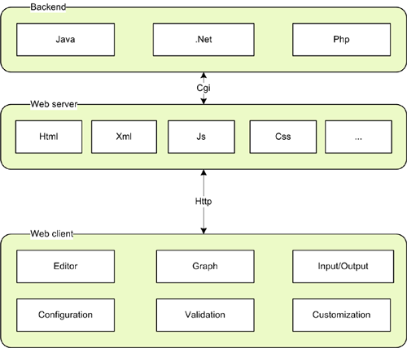

# 1.1 介绍
mxGraph是一个JavaScript组件，提供针对展示交互式图表和图形的应用程序的功能。请注意，在此处所说的图形是指数学图形，不一定是图表（尽管有些图表也是图形）。有关更多详细信息，请参见后面的“什么是图形？”部分。

作为开发人员库，mxGraph并非专门设计用于提供可用应用程序，尽管许多示例都接近可用应用程序。mxGraph提供了绘制、与之交互和将上下文与图表相关联所需的所有常见功能。mxGraph附带了一些示例，这些示例说明如何组成基本应用程序，并展示库的各个特征。

在将库集成到其应用程序中的开发人员应阅读下面的“先决条件”部分。鉴于mxGraph是您的应用程序的组成部分，因此必须了解JavaScript Web应用程序在架构层面上的构建方式，以及如何编程JavaScript以及使用任何服务器端语言。

mxGraph主要包括一个JavaScript文件，其中包含所有mxGraph功能。该文件在JavaScript部分中加载到HTML网页中，并在浏览器中的HTML容器中执行。这是一种非常简单的架构，只需要能够提供html页面的Web服务器和启用JavaScript的Web浏览器即可。

以下是该技术的主要优势：

- 不需要第三方插件，这消除了对插件供应商的依赖关系。
- 所涉及的技术都是开放的，有许多开放实现，没有一个供应商可以删除导致您的应用程序在实践中无法工作的产品或技术。
- 标准化技术意味着您的应用程序可以部署到最大数量的浏览器用户，无需在客户端计算机上进行额外的配置或安装。
- 大型公司环境通常不喜欢允许个人安装浏览器插件，也不喜欢更改向所有计算机推出的标准构建。



mxGraph组件及其关系

# 1.2 mxGraph可用于哪些应用程序？

图形可视化库的示例应用程序包括：流程图、工作流和BPM可视化、流程图、交通或水流、数据库和WWW可视化、网络和电信显示、制图应用和GIS、UML图、电子电路、VLSI、CAD、金融和社交网络、数据挖掘、生物化学、生态循环、实体和因果关系以及组织结构图。

# 1.3 mxGraph如何部署？

在典型的瘦客户端环境中，mxGraph被拆分为客户端JavaScript库和服务器端库之一，在两种支持的语言.NET和Java中。 JavaScript库作为较大Web应用程序的一部分包含在其中，并使用标准Web服务器将其传递到浏览器。所有浏览器只需要启用运行JavaScript的能力。

在本手册的第三部分中，您将看到一个嵌入了mxGraph库的HTML页面示例，以及一个简单的应用程序来调用库的功能。

# 1.4 mxGraph技术

mxGraph在浏览器上使用JavaScript来实现客户端功能。同时，JavaScript代码使用浏览器上的底层矢量图形语言来呈现所显示的图表，目前对于所有支持的浏览器而言，使用的是SVG。mxGraph还包括使用HTML进行完全呈现的功能，这限制了可用的功能范围，但适用于更简单的图示。

作为开发人员，您无需接触特定于浏览器的功能。正如前面所提到的，矢量图形语言因浏览器而异，因此mxGraph将其功能抽象成一个通用类。同样，对于事件处理和DOM，不同的浏览器在这两个主要的浏览器功能的实现上存在差异，mxGraph在所有浏览器上都公开了一个常量API，并且在后台自适应不一致性。

# 1.5 mxGraph许可证

mxGraph的JavaScript客户端采用Apache 2.0许可进行许可。对于详细的许可问题，建议您咨询法律专业人士。

# 1.6 什么是图形？
图形可视化基于网络理论的数学理论，即图论。如果您正在寻找JavaScript条形图、饼图、甘特图，请查看Google Charts项目或类似项目。

一个图形由顶点（也称为节点）和边（连接节点的线条）组成。在图论中，图形的外观并没有明确定义。本手册将使用单元格一词来描述图形的元素，可以是边、顶点或分组。


A simple Graph

在处理图形时，图论中还有一些其他定义能够提供有用的背景信息。如果您感兴趣，可以在附录中找到这些定义。

## 1.6.1 图形可视化
可视化是创建图形有用的视觉表示的过程。可视化功能范围是mxGraph的主要优势之一。mxGraph支持广泛的功能来使单元格的显示仅受开发人员的技能和平台功能的限制。顶点可以是形状、图像、矢量绘图、动画，几乎所有在浏览器中可用的图形操作。您还可以在顶点和边缘中使用HTML标记。


Graph Visualization of a transport system. (c) Tourizm Maps 2003, http://www.world-maps.co.uk

## 1.6.2 图形交互
交互是使用mxGraph的应用程序通过Web应用程序GUI更改图形模型的方式。mxGraph支持拖放和克隆单元格、调整大小和重塑、连接和断开连接、从外部源拖放、原地编辑单元格标签等功能。 mxGraph的关键优势之一是如何编程交互的灵活性。

许多复杂的图形Web应用程序依赖于回传到服务器以形成显示，不仅是基本显示，还包括交互事件。虽然通常将其称为AJAX功能，但这种服务器依赖性对于交互事件来说并不合适。在应用程序中，视觉反馈需要超过大约0.2秒通常会严重影响可用性。通过将所有交互放在客户端上，mxGraph提供了真正的应用程序体验，而不像一个愚笨的远程终端。它还允许离线使用的可能性。


Selection shading while selecting an area through mouse drag

## 1.6.3 图形布局
在简单的应用程序中，图形单元格可以绘制在任何地方，甚至在彼此之上。某些应用程序需要以一般有序或特定有序结构呈现其信息。这可能涉及确保单元格不重叠并且彼此保持至少一定的距离，或者单元格相对于其他单元格（通常是它们通过边缘连接的单元格）出现在特定位置。称为布局应用程序的此活动可用于多种方式，以帮助用户设置其图形。对于不可编辑的图形，布局应用程序是将布局算法应用于单元格的过程。对于可通过UI进行编辑的交互式图形，布局应用程序可能仅涉及允许用户更改特定位置的某些单元格，每次更改图形后重新应用布局算法，或在编辑完成后应用布局。


Layout of a workflow using a horizontal hierarchical layout

mxGraph支持一系列树形、力导向和分层布局，可以满足大多数布局需求。有关使用布局的更多信息，请参见后面的部分。

在客户端-服务器体系结构中，有两种选项可用于运行布局。Javascript版本提供了完全在客户端上运行布局的能力，而Java版本则可以在服务器端实现相同的布局，如果需要，还可以将部分处理卸载到服务器端。

## 1.6.4 图形分析
图分析涉及应用算法来确定图结构的某些细节，例如确定两个单元格之间的所有路线或最短路径。还有更复杂的图分析算法，这些算法通常应用于特定领域的任务中。聚类、分解和优化等技术往往针对某些科学领域，并且目前尚未在mxGraph核心包中实现。


Shortest Path Analysis

# 1.7 关于本手册
## 1.7.1 本手册的目的

本手册旨在帮助使用者更好地理解和使用mxGraph。为了充分发挥本手册的作用，您需要具备一定的Web应用程序和服务器技术方面的了解。对于每个支持的服务器技术，都提供了部署示例，因此需要熟悉该服务器技术。

基本的XML知识有助于更改描述编辑器视觉和行为方面的配置文件。您需要理解和实现JavaScript编码，并熟悉面向对象编程原理和现代软件设计。

您不需要了解浏览器使用的底层矢量图形语言，例如SVG或HTML画布。 mxGraph将视觉组件的描述抽象为一个API。

# 2 开始
## 2.1 mxGraph Package？
### 2.1.1 获取mxGraph
mxGraph可以从GitHub项目获取。发布的版本被标记为“va.b.c”，其中a、b和c是遵循语义化版本控制的版本号。

每个正式发布版也可以在mxGraph发布页面上以.zip或.tar.gz的格式获得。

### 2.1.2 项目结构和构建选项。

一旦解压缩，您将在安装根目录中看到许多文件和目录。

| 目录                 |  描述                                                   |
|----------------------|---------------------------------------------------------|
| /doc                 | Documentation root, includes this user manual           |
| /dotnet              | .NET server-side classes                                |
| /java                | Java server-side classes                                |
| /javascript          | JavaScript client functionality.                        |
| /javascript/examples | HTML examples demonstrating the use of mxGraph          |
| ChangeLog            | Details of the changes between releases                 |
| index.html           | Basic introduction to the library                       |
| license.txt          | The licensing terms under which you must use the library|

Table: Project Directory Structure

### 2.1.3 npm

mxGraph也可以通过npm软件包管理器获取。要将mxGraph用作依赖项，请使用npm install命令：

```bash
npm install mxgraph --save
```

可以使用require()加载该模块。它返回一个接受选项对象的工厂函数。必须向工厂函数提供诸如mxBasePath之类的选项，而不是指定为全局变量。

```javascript
var mxgraph = require("mxgraph")({
  mxImageBasePath: "./src/images",
  mxBasePath: "./src"
})
```

工厂函数返回一个“命名空间对象”，它提供对mxGraph包中所有对象的访问。例如，mxEvent对象在mxgraph.mxEvent处可用。

```javascript
var mxEvent = mxgraph.mxEvent;
mxEvent.disableContextMenu(container);
```
## 2.2 JavaScript and Web Applications

Web应用程序，特别是使用JavaScript来模拟Web浏览器中类似桌面应用程序的行为，仍然是软件工程中相对较新的领域。JavaScript面临的三个主要问题被认为是生产高质量应用程序的障碍，包括性能、缺乏桌面应用程序中可用的原生功能和浏览器之间不一致的API。

为了解决功能和API问题，已经付出了相当大的努力来开发框架库。许多这些库的要求都是由改善网站设计和可用性以及帮助生成我们通常称之为应用程序特性（菜单、窗口、对话框、持久性、事件处理等）驱动的。它们还提供了一些基本的JavaScript基础功能，桌面应用程序开发人员认为这些功能是理所当然的，例如基本算术和集合功能。

现在许多JavaScript框架都有IDE支持开发，并且所有主要浏览器现在都包含JavaScript调试器，无论是本地还是作为插件。JavaScript没有编译阶段（它是一种解释性语言），因此基本的排版错误通常只会在运行时捕获，除非你在IDE中获得语法检查工具。因此，虽然没有一个完整的JavaScript开发包满足您的需求，但有许多供应商提供您需要有效生成JavaScript应用程序所需的各个组件。

### 2.2.1 Third-Party JavaScript Frameworks
#### 2.2.1.1 Native JavaScript Frameworks and Libraries

与其列举和比较每个JavaScript框架，不如查看Web应用程序框架和JavaScript比较的维基百科条目。比较不应被视为权威，更多地是说明所提供的功能类型，例如事件处理、动画、小部件、AJAX请求支持等。

请注意，许多框架添加了隐式行为，使JavaScript看起来更像面向对象语言，并增加了语言的基础功能。在mxGraph的布局部分编写期间，发现这种隐式行为以一种非常难以调试的方式破坏了一个示例。请注意，这可能会导致问题，如果选择一个框架，请确保您了解其引入了哪些隐式行为。

在选择框架和/或库时，请考虑哪些框架将您绑定到特定的功能行为，并寻找提供诸如动画特性作为独立的区块的库，这些特性可以在不受整体设计约束的情况下使用。

#### 2.2.1.2  集成mxGraph和JavaScript框架

这个领域经常被误解，简言之，不需要进行集成。Web应用程序通常由一个或多个包含JavaScript应用程序的HTML的div元素组成。如果你创建了一个div作为mxGraph的容器，那么这个区域就是mxGraph应用程序的独立显示区域。它可以与任何后端服务器进行通信，但该div和页面的其余部分之间没有相互依赖关系，除了它们各自占据的区域。这包括事件处理，mxGraph可以处理其容器的事件，即使网页的其余部分使用完全不同的事件模型。只要mxGraph或页面上的其他库和框架没有引入破坏页面某个部分的隐含行为，客户端集成的问题就不需要进行分析。

将mxGraph后端功能（位于服务器端）集成在一起是后续章节的主题。

#### 2.2.1.3 在 JavaScript 中扩展 mxGraph
在 JavaScript 中，有多种将面向对象范式映射到语言结构的方式。mxGraph 在整个项目中使用特定的方案，并遵循以下隐含规则：
- 不要更改内置原型
- 不要试图限制 JavaScript 语言的能力。

在mxGraph中有两种“类”类型；类和单例（仅存在一个类的实例）。 单例映射到全局对象，其中变量名与类名相同。例如，mxConstants是一个对象，其中包含所有定义为对象字段的常量。通常的类被映射到构造函数和定义实例字段和方法的原型。例如，mxEditor是一个函数，并且mxEditor.prototype是mxEditor函数创建的对象的原型。mx前缀是mxGraph包中用于所有类的约定，以避免与全局命名空间中其他对象发生冲突。

对于子类化，超类必须提供一个构造函数，该构造函数要么没有参数，要么处理不带参数的调用。此外，在扩展原型之后必须重新定义特殊的constructor字段。例如，mxEditor的超类是mxEventSource。这在JavaScript中通过先将原型分配给超类的实例来表示“继承”超类的所有字段和方法，例如：

```javascript
mxEditor.prototype = new mxEventSource()
```

并使用以下方式重新定义constructor字段：
  
  ```javascript
  mxEditor.prototype.constructor = mxEditor
```

后面的规则被应用，这样就可以通过`mxUtils.getFunctionName（obj.constructor）`的名称检索对象的类型。

`Constructor`

对于mxGraph中的子类化，应该采用相同的机制。例如，要为mxGraph类创建子类，首先必须为新类定义一个构造函数。构造函数使用mxGraph函数对象上的call函数调用超级构造函数，并显式地传递每个参数：
  
  ```javascript
  function MyGraph(container)
{
   mxGraph.call(this, container);
}
```

`MyGraph`的原型如下所示，它从`mxGraph`中继承而来。像往常一样，在扩展超类之后重新定义构造函数：

```javascript
MyGraph.prototype = new mxGraph();
MyGraph.prototype.constructor = MyGraph;
```

在上面的代码之后（参见手册的I/O部分），您可能希望定义与该类关联的编解码器。这段代码将在类加载时执行，并确保使用相同的编解码器对mxGraph和MyGraph的实例进行编码。
```javascript
var codec = mxCodecRegistry.getCodec(mxGraph);
codec.template = new MyGraph();
mxCodecRegistry.register(codec);
```

`Functions`

在 MyGraph 的原型中，可以通过以下方式扩展 mxGraph 的功能。

```javascript
MyGraph.prototype.isSelectable = function(cell)
{
   var selectable = mxGraph.prototype.isSelectable.apply(this, arguments);
   var geo = this.model.getGeometry(cell);
   return selectable &&(geo == null || !geo.relative);
}
```

第一行中的 `supercall` 是可选项。它使用 `mxGraph` 原型的 `isSelectable` 函数对象上的 apply 函数完成，使用 this 和 arguments 这两个特殊变量作为参数。如果在超类中未替换函数，则只有在以下情况下才可能调用超类函数，这是 JavaScript 中另一种“子类化”的方法。

```javascript
mxGraph.prototype.isSelectable = function(cell)
{
   var geo = this.model.getGeometry(cell);
   return selectable && (geo == null || !geo.relative);
}
```

上述方案在需要完全替换函数定义时非常有用。

为了向子类添加新的函数和字段，可以使用以下代码。下面的示例添加了一个新函数来返回图形模型的 XML 表示：

```javascript
MyGraph.prototype.getXml = function()
{
   var enc = new mxCodec();
   return enc.encode(this.getModel());
}
```

`Fields`

同样，可以声明并定义一个新的字段，例如：

```javascript
MyGraph.prototype.myField = ‘Hello, World!’;
```

请注意，给 `myField` 赋的值只会在创建对象时执行一次，也就是说，所有 `MyGraph` 的实例都共享同一个值。如果你需要每个实例拥有独立的值，那么该字段必须在构造函数中定义。例如：

```javascript
function MyGraph(container)
{
   mxGraph.call(this, container);
   this.myField = [];
}
```

最后，使用下面的代码创建 `MyGraph` 的一个新实例，其中 `container` 是作为图表视图容器的 DOM 节点：

```javascript
var graph = new MyGraph(container);
```

### 2.2.2 通用 JavaScript 开发
#### 2.2.2.1 JavaScript 混淆

默认情况下，当您将 JavaScript 传递到浏览器客户端时，您会向其提供整个源代码。然后在浏览器上解释和运行该 JavaScript。在客户端运行 JavaScript 时，在任何程度上都不可能对 JavaScript 进行加密，因为 JavaScript 源代码必须被 JavaScript 解释器理解，并且解释性语言没有二进制中间形式。

可以在传输过程中加密 JavaScript 并在客户端解密和运行它，但客户端仍然能够在解密后访问源代码。

我们不进行混淆，因为方法名称形成公共 API，I/O 需要在两个通信端了解混淆。

#### 2.2.2.2 Namespaces

在标准 JavaScript 中，名称空间的概念不存在，因此在创建新类名称时要非常小心。在 mxGraph 中，所有类都以前缀“mx-”开头，以避免意外冲突或覆盖原型。

## 2.3 Hello World!

mxGraph 中的“Hello World”示例包含一个简单的客户端示例，显示具有标签“Hello”和“World！”的两个连接顶点。该示例演示了以下内容： 

- 创建 mxGraph 实例 
- 创建顶点并将其添加到图形对象中 
- 创建边缘并将其添加到图形对象中 
- 设置顶点和边缘的样式 
- 将图形渲染在 HTML 元素中 

示例代码 helloworld.html 的源代码可以在 mxGraph 评估版和完整版的 examples 目录中找到。HTML 源代码包含两个主要部分，即 head 和 body。它们包括以下主要元素，可用作构建基本 mxGraph 应用程序的模板：

- `mxBasePath`: 这是一个JavaScript变量，定义了css，images，resources和js目录所在的目录。它是JavaScript代码，需要放置在script标签中。这必须出现在加载mxClient.js之前，并且不应具有尾部斜杠。

- `mxClient.js`：这是mxGraph库的路径。如果HTML文件在本地执行，则路径可能是计算机本地路径或公共Internet路径。如果从Web服务器下载HTML页面，则路径通常是公共Internet路径。

- `容器的创建`：在代码底部，在body元素中，定义在加载网页时调用的函数（onload的值）。它将一个div容器作为参数传入，该参数在下面被定义。此div是mxGraph组件将放置其中的容器。在此示例中，应用了网格背景，正如在图表应用程序中常见的一样。容器创建时未描述图形视觉化的任何其他部分，除了背景以及容器的宽度和高度。
请注意，如果您不希望出现滚动条，则始终应使用overflow:hidden样式。

- `入口函数`：文件的主要代码是在此处在页面加载时执行的入口方法。这是JavaScript代码，必须在JavaScript脚本元素内。任何mxGraph应用程序的前几行都应该检查浏览器是否受支持，并在不支持的情况下适当退出。如果浏览器受支持，则在div容器中创建一个mxGraph，并在begin/end update调用之间向图形添加了三个单元格。


The mxGraph HelloWorld example

```html
<html>
<head>
   <title>Hello, World! example for mxGraph</title>

   <!-- Sets the basepath for the library if not in same directory -->
   <script type="text/javascript">
      mxBasePath = '../src';
   </script>

   <!-- Loads and initializes the library -->
   <script type="text/javascript" src="../src/js/mxClient.js"></script>

   <!-- Example code -->
   <script type="text/javascript">
      // Program starts here. Creates a sample graph in the
      // DOM node with the specified ID. This function is invoked
      // from the onLoad event handler of the document (see below).
      function main(container)
      {
         // Checks if the browser is supported
         if (!mxClient.isBrowserSupported())
         {
            mxUtils.error('Browser is not supported!', 200, false);
         }
         else
         {
            // Creates the graph inside the given container
            var graph = new mxGraph(container);

            // Enables rubberband selection
            new mxRubberband(graph);

            // Gets the default parent for inserting new cells. This
            // is normally the first child of the root (ie. layer 0).
            var parent = graph.getDefaultParent();

            // Adds cells to the model in a single step
            graph.getModel().beginUpdate();
            try
            {
               var v1 = graph.insertVertex(parent, null,
                        'Hello,', 20, 20, 80, 30);
               var v2 = graph.insertVertex(parent, null,
                        'World!', 200, 150, 80, 30);
               var e1 = graph.insertEdge(parent, null, '', v1, v2);
            }
            finally
            {
               // Updates the display
               graph.getModel().endUpdate();
            }
         }
      };
   </script>
</head>

<!-- Page passes the container for the graph to the program -->
<body onload="main(document.getElementById('graphContainer'))">

   <!-- Creates a container for the graph with a grid wallpaper -->
   <div id="graphContainer"
      style="overflow:hidden;width:321px;height:241px;background:url('editors/images/grid.gif')">
   </div>
</body>
</html>
```

在这个练习中需要注意的重要概念是：

- mxClient.js 是一个 JavaScript 文件，它包含了 mxGraph 的所有 JavaScript 源代码。从 web 服务器下载时，获得所有 JavaScript 文件作为一个文件比作为很多单独文件要快得多，因为每个文件需要请求/确认所需的开销。速度增加通常至少是x2，但它取决于服务器具有打开一个客户端的并行套接字的能力。
- JavaScript 代码及其依赖项都被放置在 head 元素中。
- Internet Explorer 默认启用安全选项，当尝试从本地文件系统运行 JavaScript 时会出现用户提示。这可以在选项菜单中禁用，但请注意，在本地文件系统上运行不是 mxGraph 的部署场景，这仅会在开发过程中发生。
您的应用程序可以编写和链接到 HTML 文件中，或者以 mxClient.js 文件中的方式链接到单独的 JavaScript 源代码中，然后再链接到 HTML 中。

## 2.4 使用mxGraph进行部署和调试

在 mxClient.js 文件中有两个版本，一个用于生产环境，另一个用于开发/调试。mxClient.js 位于 javascript/src/js 是生产版本，javascript/debug/js/mxClient.js 则是用于开发/调试的版本。生产版本中会剥除掉所有的空格和注释以确保文件尽可能地小。这会导致大多数 JavaScript 调试工具无法使用。因此在开发时，建议使用带有空格和注释的调试版本，在支持的浏览器中进行调试。

两个 mxClient.js 文件都包含了 mxGraph 的整个 JavaScript 源码，其中所有的空格和注释都已被删除，以减小文件大小。如果需要调试 mxGraph 库本身，则在调试过程中最好使用单独的源文件。mxGraph 的源代码版本可以在 javascript/devel 目录下的 source.zip 文件中找到。将该文件解压缩到 mxBasePath 中，并删除完整的 mxClient.js 文件的加载，即可更轻松地调试 mxGraph。请注意，源 zip 文件中的 mxClient.js 文件是一个引导文件，它会加载所有其他的 JavaScript 源代码。

客户端源代码的下载速度还可以通过压缩代码进一步提高。现代浏览器都支持接收和解压服务器端压缩的传输。而且好的 web 服务器也会检测不支持压缩的浏览器并将未压缩的版本作为后备发送。

例如，在 Apache Web 服务器上，有一个 mod_deflate 模块可以进行压缩，在网络上搜索相关信息即可了解如何使用该模块。jgraph.com 服务器就是使用此模块，并且在任何受支持的浏览器中均无异常报告。

使用压缩功能后，mxClient.js 文件的大小可以从约 600KB 缩小到约 130KB。在大多数现代网络上，用户不会注意到这种差异，但在某些情况下，较小的版本可能更可取。

# 3. mxGraph模型和单元格
## 3.1 Core mxGraph architecture
### 3.1.1 The mxGraph Model

在mxGraph中，mxGraph模型是描述图形结构的核心模型，其类称为mxGraphModel，可以在model包中找到。对于图形结构的添加、更改和删除都是通过图形模型API进行的。该模型还提供了确定图形结构的方法，并提供设置可视状态（如可见性、分组和样式）的方法。

然而，虽然对模型的事务存储在模型上，但mxGraph是以这样一种方式设计的，即主要公共API是通过mxGraph类实现的。"将此单元格添加到图形中"的概念比"将此单元格添加到图形模型中"更自然。在直观的情况下，在模型和单元格上可用的函数会在图形上复制，那些在图形类上的方法被认为是主要公共API。本手册的其余部分将给出这些关键API方法的粉色背景：

anExampleCoreAPIMethod()

因此，尽管许多主要API调用是通过mxGraph类进行的，但请记住，mxGraphModel是存储您的图形数据结构的基础对象。

mxGraph使用事务系统来对模型进行更改。在HelloWorld示例中，我们看到了这段代码：

```javascript
// Adds cells to the model in a single step
graph.getModel().beginUpdate();
try
{
   var v1 = graph.insertVertex(parent, null, 'Hello,', 20, 20, 80, 30);
   var v2 = graph.insertVertex(parent, null, 'World!', 200, 150, 80, 30);
   var e1 = graph.insertEdge(parent, null, '', v1, v2);
}
finally
{
   // Updates the display
   graph.getModel().endUpdate();
}
```

要执行插入2个顶点和1个边的操作，您需要对模型进行更改。 对于您对模型所做的每个更改，都需要调用beginUpdate()，进行相应的模型更改，然后调用endUpdate()来完成更改并发送更改事件通知。

**Key API Methods**:

- mxGraphModel.beginUpdate() - 开始一个新的事务或子事务.
- mxGraphModel.endUpdate() - 完成一个新的事务或子事务.
- mxGraph.addVertex() - 向指定的父单元格添加新顶点.
- mxGraph.addEdge() - 向指定父单元格添加新边.

**注意**:
技术上讲，您不必使用begin和end update调用来包围您的更改。在此更新范围之外进行的更改立即生效并立即发送通知。实际上，在更新范围内进行的更改会立即对模型产生影响，更新范围用于控制事件通知的时间和连接。除非更新的包装导致代码美学问题，否则习惯使用它可以避免事件和撤消粒度可能出现的问题。

请注意，将模型更改包装在try块中，并在finally块中使用endUpdate()方法。这确保更新完成，即使模型更改出现错误也是如此。无论何时进行模型更改，都应使用此模式以便于调试。

暂时忽略对父单元格的引用，稍后在本章中将对其进行解释。

### 3.1.2 模型交互

蓝色块中的子事务是指事务可以嵌套。也就是说，该模型中有一个计数器，每次调用beginUpdate时递增，每次调用endUpdate时递减。当此计数器增加至少为1时，当此计数器再次达到0时，模型事务被视为完成，并触发模型更改的事件通知。

这意味着代码中的每个子包含部分都可以（并且应该）被begin/end组合括起来。在mxGraph中，这提供了创建可用作“库事务”的单独事务、创建复合更改以及为所有更改触发一组事件并仅创建一个撤销的功能。自动布局是需要此功能的一个很好的例子。

在自动布局中，用户通过用户界面对图形进行更改，应用程序根据某些规则自动定位结果。自动定位，即布局，是在begin/end更新调用之间的独立算法，不知道更改的具体情况。因为在begin/end更新内的所有更改都直接针对图形模型进行，所以布局可以在更改正在进行时根据模型状态进行操作。

重要的是要区分作为复合更改的一部分而对图形模型进行操作的功能和响应原子图形更改事件的功能之间的区别。对于自动布局等第一种情况，功能接受现有模型并对其进行操作。此方法仅应用于复合模型更改的部分。应用程序的所有其他部分应仅对模型更改事件作出反应。

当最后一个endUpdate调用将计数器减少回到0时，将触发模型更改事件，并指示已发生至少一次原子图形更改。更改事件包含有关修改的完整信息（有关更多详细信息，请参见有关事件的后面部分）。

#### 3.1.2.1 模型更改事件

以下是一些改变图形模型的方法列表，应该直接或间接地放在更新范围内

- add(parent, child, index)
- remove(cell)
- setCollapsed(cell, collapsed)
- setGeometry(cell, geometry)
- setRoot(root)
- setStyle(cell, style)
- setTerminal(cell, terminal, isSource)
- setTerminals(edge,source,target)
- setValue(cell, value)
- setVisible(cell, visible)

最初，我们只关注添加和删除方法以及几何和样式编辑方法。请注意，这些不是核心API方法，通常这些方法在mxGraph类中，它们为您执行更新封装。

设计背景：一些人会因模型存储了视觉信息而感到困惑。这些属性包括单元格位置、可见性和折叠状态。模型存储这些属性的默认状态，提供了一个公共的地方来在每个单元格上设置它们，而视图可以在每个视图上覆盖这些值。模型只是体系结构中第一个可以在全局范围内设置这些属性的公共地方。记住，这是一个图形可视化库，可视化部分是核心功能。

**Inserting Cells**

在 HelloWorld 应用程序中创建的三个图形单元是两个顶点和连接这些顶点的一条边。如果您不熟悉基本的图论及其术语，请参阅维基百科。

您可以使用模型上的 add() 方法添加顶点和边。但是，为了此库的一般用法，请学习 mxGraph.insertVertex() 和 mxGraph.insertEdge() 是添加单元格的核心公共 API。模型的功能要求要添加的单元格已经被创建，而 mxGraph.insertVertex() 为您创建该单元格。

**Core API functions:**

- `mxGraph.insertVertex(parent, id, value, x, y, width, height, style)` – creates and inserts a new vertex into the model, within a begin/end update call.

- `mxGraph.insertEdge(parent, id, value, source, target, style)` – creates and inserts a new edge into the model, within a begin/end update call.

`mxGraph.insertVertex()` 将创建一个 mxCell 对象，并从所使用的方法返回它。该函数的参数为：

- `parent` - 是新单元格在组结构中的直接父单元格。 我们稍后会讨论组结构，但现在请使用 graph.getDefaultParent(); 作为默认父级，就像 HelloWorld 示例中使用的那样。
- `id` - 这是描述单元格的全局唯一标识符，它始终是一个字符串。 主要用于在外部持久性输出中引用单元格。 如果您不希望自行维护 ID，请将 null 传递到此参数中，并确保 mxGraphModel.isCreateIds() 返回 true。 这样，模型将管理 ID 并确保它们是唯一的。
- `value` - 这是单元格的用户对象。 用户对象只是对象，但形成允许将应用程序的业务逻辑与 mxGraph 的视觉表示相关联的对象。 它们将在本手册中进一步描述，但是，首先，如果您将字符串用作用户对象，则将其显示为定点或边缘上的标签。
- `x，y，width，height` - 如名称所示，这些是顶点左上角的 x 和 y 位置以及其宽度和高度。
- `style` - 要应用于此定点的样式描述。 样式将在稍后更详细地描述，但在简单的级别上，此参数是遵循特定格式的字符串。 在该字符串中出现零个或多个样式名称以及某些键/值对，这些键/值对覆盖全局样式或设置新样式。 在创建自定义样式之前，我们将仅使用当前可用的样式。

使用边添加方法时，与顶点添加方法中同名的参数具有相同的功能。源（source）和目标（target）参数定义了连接边缘的顶点。请注意，源和目标顶点应先已插入模型中。

### 3.1.3 mxCell

mxCell是用于顶点和边缘的单元格对象。mxCell复制了模型中可用的许多功能。使用模型方法的关键区别在于，使用模型方法会创建适当的事件通知和撤消，而使用单元格会进行更改，但没有更改记录。例如，这可以用于临时视觉效果，如动画或鼠标悬停时的更改。总的原则是，除非遇到特定问题，否则请使用模型编辑API。构造新单元格时，需要三个要素：一个值（用户对象），一个几何形状和一个样式。现在我们将探讨这3个概念，然后回到单元格。

#### 3.1.3.1 Styles

概念上，样式和样式表与CSS样式表类似，但请注意，CSS实际上仅用于影响HTML页面的DOM中的全局样式，而mxGraph中使用的是相似的概念。打开您的编辑器中的util.mxConstants.js文件并搜索“STYLE_”上的第一个匹配项。如果您向下滚动，您将看到定义了许多具有此前缀可用的各种样式的字符串。其中一些样式应用于顶点，一些应用于边缘，而一些则同时应用于两者。正如您所看到的，这些定义了它们作用于的元素的视觉属性。

mxStylesheet包含一个对象styles，它是将样式名称映射到样式数组的哈希表。


Style arrays within the styles collection