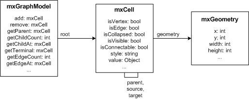

# 1. Overview

mxGraph包含一个客户端软件，使用JavaScript编写，并且有一系列用于各种语言的后端。客户端软件是一个图形组件，具有可选的应用程序包装器，可集成到现有的Web界面中。客户端需要Web服务器将所需文件传输给客户端，也可以在没有Web服务器的情况下从本地文件系统运行。后端可以直接使用，也可以嵌入到受支持语言之一的现有服务器应用程序中。


如果存在后端，则可以以各种方式配置客户端以使用此后端，例如：

- Creating images
- Storing and loading diagrams
- Creating an object representation of a graph

上述情况可以以各种方式组合使用，例如随时向后端发送每个更改的 XML 描述，或自动保存图表以避免客户端数据丢失。客户端还可以在离线模式下运行，在此模式下，它不需要后端或 Web 服务器。

请查看各个目录中的索引文件，了解有关各种后端的信息。

# 2 Hello, World!

mxGraph 的 Hello, World! 示例在单个 HTML 文件中提供，其中包含所需的命名空间、mxGraph 库脚本和示例代码。可以通过将 Firefox 或 Internet Explorer 指向上面的链接，在本地文件系统或 Web 服务器上查看示例。要显示示例源，请在 Firefox 中按 Control-U，或在 Internet Explorer 中单击“页面”、“查看源代码”。

## 2.1 Library
页面的 HEAD 部分包含 JavaScript 代码和依赖项。使用以下代码加载库。mxBasePath 变量用于定义库从中加载其资源的路径。在加载库代码之前必须定义此变量，不应包括尾随斜杠。
```javascript
<script type="text/javascript">
  mxBasePath = 'javascript/src';
</script>
<script type="text/javascript" src="javascript/src/js/mxClient.js"></script>
```

mxClient.min.js 包含单个、压缩的所有所需代码。这是您应该在生产中使用的文件。在开发过程中，如果您希望更改 mxGraph 的源，请使用引导程序 mxClient.js 文件。

## 2.2 Browser Check

在 HEAD 部分中的下一个 script 标签包含 Hello, World! 的示例代码。代码的第一部分检查显示页面的浏览器是否支持该库。建议将此作为程序的第一步，并在浏览器不受支持时显示错误消息。在文档中，您可能还想为禁用 JavaScript 的浏览器包含 NOSCRIPT 指令，但在我们的示例中，未使用此指令。

对于主函数的名称没有约定。该函数从页面的 onload 处理程序中调用，并且可能具有任何名称和参数。在这种情况下，参数是包含图形的 DOM 节点。请注意，DOM 节点可以具有任何 ID，并且代码与此 ID 无关。
```javascript
<script type="text/javascript";>
function main(container)
{
  // Checks if the browser is supported
  if (!mxClient.isBrowserSupported())
  {
    // Displays an error message if the browser is not supported.
    mxUtils.error('Browser is not supported!', 200, false);
  }
  ...
  ```

  ## 2.3 Container

  为了让 JavaScript 实际呈现图形，页面包含一个DOM节点，该节点将显示图形。该 DOM 节点是动态创建的，或者可以通过 document.getElementById 使用ID获取，如Hello, World! 示例中所示。DOM节点被传递给主函数，并用于构建图形实例，如下所示。

如果您希望容器具有滚动条，请在容器的样式中使用 overflow:auto CSS 指令，而不是 overflow:hidden。

## 2.4 Graph
代码构造了一个空的图形模型，并将容器和空模型传递给图形构造函数。对于此示例，在最后一行禁用了所有默认事件处理。
```javascript
var model = new mxGraphModel();
var graph = new mxGraph(container, model);
```

如果您想让图形为只读状态，可以使用 `graph.setEnabled(false)`。

## 2.5 Vertices and Edges

为了插入顶点和边，需要使用 `beginUpdate()` 和 `endUpdate()` 来创建事务。`endUpdate()` 应该始终放在 finally 块中以确保它总是在 `beginUpdate()` 执行后执行，但 `beginUpdate()` 应该不是 try 块的一部分，以确保当 `beginUpdate()` 失败时永远不会执行 `endUpdate()`。这对于模型保持一致的状态非常重要，即对于每个 `beginUpdate()` 调用，应该始终存在一个 `endUpdate()` 调用。

try 块内的部分创建图形的顶点和边缘。默认的父对象是从图形中获取的，通常是模型中根单元格的第一个子元素，当使用无参的图形模型 c'tor 时自动创建该单元格。

```javascript
// Gets the default parent for inserting new cells. This
// is normally the first child of the root (ie. layer 0).
var parent = graph.getDefaultParent();

// Adds cells to the model in a single step
model.beginUpdate();
try
{
  var v1 = graph.insertVertex(parent, null, 'Hello,', 20, 20, 80, 30);
  var v2 = graph.insertVertex(parent, null, 'World!', 200, 150, 80, 30);
  var e1 = graph.insertEdge(parent, null, '', v1, v2);
}
finally
{
  // Updates the display
  model.endUpdate();
}
```

使用 `beginUpdate()` 和 `endUpdate()` 不仅可以提高显示性能，而且还可用于在使用撤消/重做时标记可撤销更改的边界。

# 3 Graphs

为了创建图形，请实例化 `mxGraph`。这是API中的核心类。其他所有内容都是辅助性的。


要创建一个新的图形实例，需要一个DOM节点（通常是DIV）：
  
  ```javascript
  var node = document.getElementById('id-of-graph-container');
var graph = new mxGraph(node);
```

## 3.1 Model

mxCell 定义了图形模型的元素，该模型由 mxGraphModel 实现。


图形模型具有以下属性：
- 图的根元素包含层。每个层的父元素是根元素。
- 每个层可以包含图形模型的元素，即顶点、边和组。
- 组可以递归地包含图形模型的元素。
- 图和结构信息都存储在单元格中，用户对象也存储在单元格中，用于存储与单元格相关联的值（也称为业务对象）。

创建一个带有根单元格和默认图层（第一个子级）的新图形模型。

```javascript
var root = new mxCell();
root.insert(new mxCell());
var model = new mxGraphModel(root);
```

## 3.2 Stylesheet

图形中单元格的外观是由样式表定义的，它是 mxStylesheet 的一个实例。样式表从样式名称映射到样式。样式是用于单元格的键值对数组。键在 mxConstants 中定义，值可以是字符串、数字、JavaScript 对象或函数。

要修改现有图形中顶点和边的默认样式：

```javascript
var vertexStyle = graph.getStylesheet().getDefaultVertexStyle();
vertexStyle[mxConstants.STYLE_ROUNDED] = true;

var edgeStyle = graph.getStylesheet().getDefaultEdgeStyle();
edgeStyle[mxConstants.STYLE_EDGE] = mxEdgeStyle.TopToBottom;
```

## 3.3 Styles

单元格的样式信息存储在 cell.style 中。样式是单元格状态的一部分，通常通过 mxGraphModel.setStyle 进行更改，这将更新所有视图。单元格样式是以下形式的字符串：

```javascript
[stylename;|key=value;]
```
该字符串告诉图形使用给定的命名样式，并按照给定的顺序覆盖指定的键值对。例如，要使用圆角样式并覆盖 stroke 和 fillColor，则可以定义如下样式：

```
rounded;strokeColor=#FF0000;fillColor=#00FF00
```

以下是使用上面提到的方式使“Hello, World！”顶点具有指定样式名称的示例代码:

```javascript
var v1 = graph.insertVertex(parent, null, 'Hello',
  20, 20, 80, 30, 'rounded;strokeColor=red;fillColor=green');
  ```

  ## 3.4 Appearance

  在某些情况下，您可能希望根据单元格的动态属性（例如其值，即 userobject）覆盖特定属性，例如图片、指示器形状、-image、-color 或 -gradient color。在这种情况下，您可以分别重写 getImage、getIndicatorShape、getIndicatorImage、getIndicatorColor 和 getIndicatorGradientColor。请注意，这些方法以单元格状态作为参数，该参数指向单元格样式的“已解析”（即数组）版本。因此，getImage 的默认实现如下所示：

  ```javascript
  mxGraph.prototype.getImage = function(state)
{
  if (state != null && state.style != null)
  {
    return state.style[mxConstants.STYLE_IMAGE];
  }
  return null;
}
```

此方法可被覆盖，以便为给定状态返回任何图像。通常，图像由 state.cell 定义，它指向与该状态相关联的图形单元格，或者通过 state.cell.value 定义，它指向单元格的用户对象。

由于显示的性质，所有单元格都只创建一次，并且仅在模型触发更改通知时更新，因此您必须为每个图像已更改的单元格调用 view.invalidate(cell)，并调用 view.validate 来更新显示。

# 4 Editors

实例化 mxEditor 以创建编辑器。这是编辑器包中的核心类。此包中的所有其他内容都是辅助性的。要创建一个新的编辑器实例并使用配置文件进行配置，可以将配置文件的名称传递给 mxEditor 构造函数。


要创建新的编辑器实例并进行配置，可以使用以下代码:

```javascript
var config = mxUtils.load('editors/config/keyhandler-commons.xml').getDocumentElement();
var editor = new mxEditor(config);
```

配置文件是一个XML文件，它被传递给mxCodec，mxCodec再使用mxEditorCodec和其他方法将XML读入编辑器对象层次结构。通常在启动时通过I/O子系统来配置编辑器、图形、模型、工具栏、弹出菜单等。

## 4.1 CSS

CSS 样式表包含用户界面的各种元素（例如橡皮筋选择、原地编辑器或弹出式菜单）的样式定义。它还包含在 Internet Explorer 中启用 VML 支持所需的指令，因此将样式表包含在页面中非常重要。

可以通过 mxClient.link('stylesheet', filename) 编程方式添加其他样式表，也可以通过编辑器配置中 UI 部分的样式表标签添加其他样式表，例如：

```xml
<mxEditor>
  <ui>
    <stylesheet name="examples/editors/css/process.css"/>
    ...
```

## 4.2 Templates

要添加新的单元格类型，请按以下方式在配置文件中模型的模板数组部分（mxEditor/mxGraph/mxGraphModel/Array[as=templates]）创建一个模板：

```xml
<add as="symbol">
  <Symbol label="Symbol" customAttribute="whatever">
    <mxCell vertex="1" connectable="1" style="symbol;image=images/event.png">
      <mxGeometry as="geometry" width="32" height="32"/>
    </mxCell>
    <CustomChild customAttribute="whatever"/>
  </Symbol>
</add>
```
add-element 的 as 属性包含模板后续可访问的名称。Symbol-child 元素是自定义（即工作流）元素，可以使用任何名称和任意数量的子元素和自定义属性。label 属性是一个特殊的属性，用于图形中单元格的文本表示。mxCell 元素是另一个特殊的子节点，其中包含单元格的图形信息，即单元格类型、样式、大小和位置。

如果您想要使用其他属性或属性组合来进行文本表示，则可以查看 mxGraph.convertValueToString，如果需要处理就地编辑并将新的文本值存储在相应的属性中，则可以查看 mxCell.valueChanged。

## 4.3 Toolbar

使用图表中的模板，必须添加一个工具栏项，该项引用配置文件（mxEditor / mxDefaultToolbar [as = toolbar]）中mxDefaultToolbar部分中的模板，如下所示：
  
  ```xml
  <add as="symbolTool" template="symbol"
  style="symbol;image=wf/images/bpmn/special_event.png"
  icon="wf/images/bpmn/small_event.gif"/>
```

as属性指定了工具栏中图标的提示信息，template属性引用之前添加的模板的名称。style属性为可选项，可用于重写模板定义中定义的样式。最后，icon指定了工具栏项目所使用的图标。

请注意，as属性假定是语言资源的键，在本例中为symbolTool。如果在mxResources中没有定义该资源，则使用属性值作为标签。

# 5 Input/Output

默认的编码方案将所有非对象字段映射到字符串属性，将所有对象字段映射到子节点，并使用对象的构造函数名称作为节点名称，使用字段名称作为as属性值。此默认编码方案可以被自定义编解码器覆盖，这些编解码器在mxCodecRegistry中注册。

例如，考虑以下JavaScript对象定义：
  
  ```javascript
  var object = new Object();
object.myBool = true;
object.myObject = new Object();
object.myObject.name = 'Test';
object.myArray = ['a', ['b', 'c'], 'd'];
```

为了对该对象进行编码并在新窗口中显示生成的XML，可以使用以下代码：

```javascript
var encoder = new mxCodec();
var node = encoder.encode(object);
mxUtils.popup(mxUtils.getXml(node));
```

这是表示该对象的XML结构：

```xml
<Object myBool="1">
  <Object name="Test" as="myObject"/>
  <Array as="myArray">
    <add value="a"/>
    <Array>
      <add value="b"/>
      <add value="c"/>
    </Array>
    <add value="d"/>
  </Array>
</Object>
```
请注意，编解码器将布尔值转换为数字值，如果数组索引为数字，则不会存储，并且非对象数组成员存储在value属性内。此外，可以通过在XML结构中使用include指令来包含其他XML文件

## 5.1 Files

以下是简体中文翻译：

save、open、readGraphModel和writeGraphModel函数实现了在mxEditor中处理文件的标准机制。 

mxEditor.save的默认实现会使用一个参数来指示保存是由用户还是系统触发的。然后，它会使用编辑器对象的urlPost变量来检查是否应该发出post请求。如果该变量已定义，则编辑器向指定的URL发出post请求，并将XML作为名为xml的POST变量传递。

## 5.2 Post
例如，考虑下面的PHP文件，它位于与HTML页面相同的目录中。如果文件名为server.php，则必须在编辑器上将urlPost变量设置为server.php，以便将图表发布到服务器。PHP文件将从POST请求获取XML并将其写入名为diagram.xml的文件中。

```php
<?php
$xml = $HTTP_POST_VARS['xml'];
if ($xml != null) {
  $fh=fopen("diagram.xml","w");
  fputs($fh, stripslashes($xml));
  fclose($fh);
}
?>
```
要设置发布URL，请按以下方式更改配置文件中的mxEditor节点中的相应条目：
```xml
<mxEditor urlPost="http://www.example.com/server.php" ... >
```

请记住，JavaScript 只能发送到它来源的服务器，因此我们建议使用相对 URL，例如 server.php。

## 5.3 Form Fields

如果您需要从/向字符串读写图形（例如用于填充表单字段），可以使用以下方法：
```javascript
var data = editor.writeGraphModel();
editor.readGraphModel(mxUtils.parseXml(data));
```
## 5.4 Codecs(编解码器)
如果需要对其他对象进行编码，或者没有可用的编辑器实例，则可以使用 mxCodec 创建和读取 XML 数据。